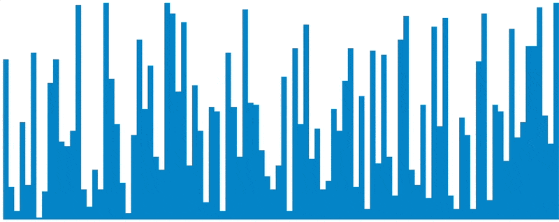

<h1 align="center">Sorting Algorithm Visualizer</h1>

A dynamic sorting algorithm visualizer built using HTML, CSS, and JavaScript. This project provides interactive animations for popular sorting techniques like Quick Sort, Merge Sort, and Bubble Sort. It highlights my ability to build engaging web applications and implement complex algorithms efficiently.

  
  

    <a href="https://harrisonhjk.com/HJK-SortVisualizer/" target="_blank">
      🌐 Explore the Sorting Algorithm Visualizer here! 
    </a>
  

## Features

- 🖥️ **Interactive Visualizer**: Animations for sorting algorithms that demonstrate step-by-step sorting processes.
- 🎨 **Modern Design**: Clean and responsive user interface with intuitive controls.
- 🚀 **Performance Optimized**: Efficient implementations of sorting algorithms, ensuring smooth animations.
- 🛠️ **Customizable Settings**: Users can adjust array size, sorting speed, and algorithm selection.

## Built from Scratch

- **No Plugins or Libraries**: This project uses pure HTML, CSS, and JavaScript, without relying on any third-party libraries or frameworks.
- **Hand-Coded Algorithms**: Every sorting algorithm was implemented manually to highlight my problem-solving and coding skills.
- **Custom Animations**: The animations were crafted using CSS and vanilla JavaScript, showcasing control over UI behavior and performance.

## Technologies Used

- **HTML5**: For structuring the visualizer interface.
- **CSS3**: For styling, animations, and responsive design.
- **JavaScript (ES6)**: For implementing sorting algorithms and dynamic interactivity.

## Algorithms Visualized

1. **Bubble Sort**
2. **Selection Sort**
3. **Merge Sort**
4. **Quick Sort**
5. **Heap Sort**
6. **Insertion Sort**

## What Makes This Project Special to me

What I’m most proud of is how the smoothness of the animations allows you to "feel the algorithms" in a way that goes beyond traditional visualizations. This approach provides an intuitive way for anyone (even those without coding experience) to grasp the essence of these algorithms, abstracted from the code itself.
